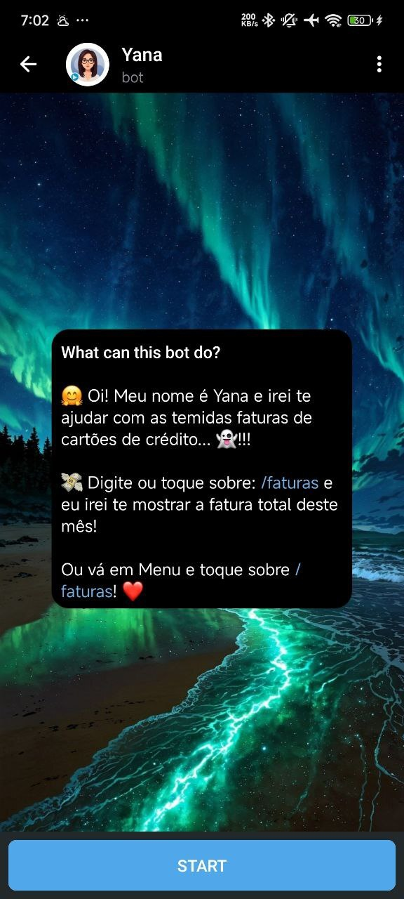
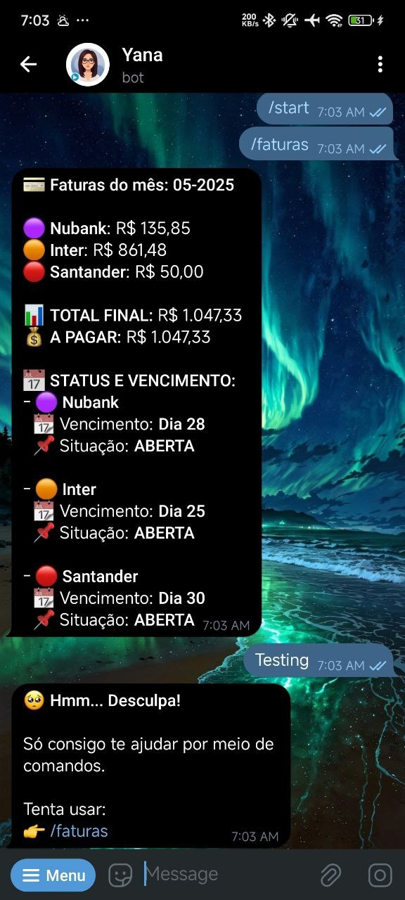

# Yana 🧾📱

<p align="center">
  
</p>

<p align="center">
  
  <a href="https://deepwiki.com/FelipheMP/Yana-TelegramBot"></a>
  
  
  
</p>

**Yana** is a lightweight and stylish Telegram bot that fetches credit card invoice data from a Google Sheets document and displays it in a modern, emoji-rich format. It’s perfect for keeping track of your monthly expenses directly through Telegram! 💸📊

---

## ✨ Features

- 📥 Fetches invoice values from multiple cards (e.g., Nubank, Inter, Santander)
- 💬 Beautifully formatted response with:
  - Per-card amount and progress bar
  - Due dates and payment status
  - Monthly totals
- 🎨 Color and emoji styling per card
- ☁️ Data sourced from a public Google Sheets CSV link
- 🌐 Built with FastAPI and deployable to Render (or any cloud)

---

## 🤖 Available Commands

| Command     | Description                                 |
|-------------|---------------------------------------------|
| `/faturas`  | Returns the monthly invoice summary         |
| any message | The bot gently replies asking for commands  |

---

## 🧰 Requirements

- Python 3.10+
- Telegram Bot Token (via [@BotFather](https://t.me/BotFather))
- Public link to a Google Sheets CSV export

### 📦 Install Python dependencies

```bash
pip install -r requirements.txt
```

Your `requirements.txt` should include:

```
python-dotenv
fastapi
uvicorn
httpx
pydantic
```

---

## 🔐 Environment Variables

Create a `.env` file at the root of the project:

```env
BOT_TOKEN=your_telegram_bot_token
CSV_URL=public_link_to_your_google_sheets_csv
SHEET_LINK=https://your_shared_sheet_link
RENDER_URL=optional_url_for_render_deployment
AUTHORIZED_CHAT_IDS=your_personal_chat_id,another_one,group_chat_id,another_one
```

> ⚠️ **Never commit your `.env` file to version control!**  
> Make sure to add `.env` to `.gitignore`.

---

## 🚀 Running the Bot

### 🔄 Development mode

To run locally with auto-reload:

```bash
uvicorn main:app --reload
```

You can use a tool like [ngrok](https://ngrok.com/) to test Telegram webhook locally.

### ☁️ Deployment to Render

Create a web service using `main:app` as the entry point. The `RENDER_URL` is used to ping itself periodically to prevent free-tier sleeping.

---

## 📸 Sample Output

Here’s how the bot outputs information in a Telegram chat:

 

---

## 🔐 Security Notes

- 🔑 Keep your bot token and links secure.
- ❌ Never expose your `.env` or secrets publicly.
- ✅ Use environment variables for safe deployment.

---

## 🤝 Contributing

Contributions are welcome!  
Bug reports, suggestions, and pull requests are appreciated. 🛠️  
Let’s make this bot better together. 💬✨

---

## 👨‍💻 Author

Made with ❤️ by [FelipheMP](https://github.com/FelipheMP)

---

## 📄 License 

GPL-3.0. See [LICENSE](./LICENSE) for more details.
